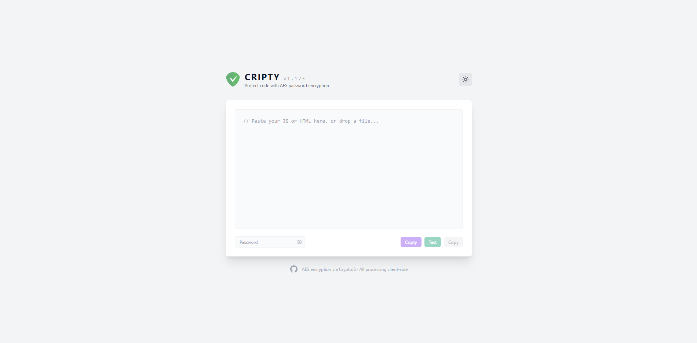

# Cripty — Code Protector

> Protect your JavaScript and HTML with AES password encryption.  
> Self-decrypting output. No server. No dependencies at runtime.

<div align="center">

### [→ Try it live](https://leonardociaccio.github.io/Cripty/cripty.html)

<br>



</div>

---

## What is Cripty?

Cripty is a single-page tool that lets you **encrypt JavaScript or HTML code with a password**. The output is a self-contained HTML snippet that, when opened in a browser, prompts for the password and — if correct — decrypts and executes the content on the fly.

Everything runs **entirely client-side**. Nothing is sent to any server.

---

## How it works

1. **Paste** your JavaScript or HTML into the editor, or **drag & drop** a file
2. **Enter a password**
3. Click **Cripty** — the editor is replaced with the encrypted output
4. **Save** the output as an `.html` file or **copy** it to clipboard
5. Anyone who opens that file will be prompted for the password

If the password is wrong, the prompt repeats. Press **Esc** to exit.

---

## Auto-detection

Cripty automatically detects the type of content:

| Content | Detected as | Execution method |
|---|---|---|
| Does not start with `<` | **JS** | `eval()` |
| Starts with `<html>` or `<!DOCTYPE>` | **HTML page** | Blob URL via `URL.createObjectURL` |
| Starts with `<` (partial markup) | **HTML snippet** | Wrapped in `<html><body>` then Blob URL |

---

## Features

- 🔒 **AES encryption** via [CryptoJS](https://github.com/brix/crypto-js)
- 🎯 **Auto-detect** JS / HTML / XML — no manual mode switching
- 🌗 **Dark & Light mode** toggle
- 📂 **Drag & drop** file support
- 💾 **Save as HTML** with custom filename
- 📋 **Copy to clipboard** in one click
- 🔁 **Password retry loop** — wrong password re-prompts instead of failing silently
- 🧩 **Single file** — one `.html`, zero build tools, zero backend

---

## Encryption

Cripty uses **AES symmetric encryption** (via CryptoJS 4.x). The encrypted payload is Base64-encoded and embedded in a hidden `<div>`. A self-contained decryption script is injected alongside it — the only external dependency it loads at runtime is CryptoJS from cdnjs.

---

## Usage

No installation required. Open [`cripty.html`](https://leonardociaccio.github.io/Cripty/cripty.html) directly in any modern browser, or clone the repo and open the file locally.

```bash
git clone https://github.com/LeonardoCiaccio/Cripty.git
cd Cripty
open cripty.html
```

---

## Tech stack

- [Tailwind CSS](https://tailwindcss.com/) (CDN)
- [CryptoJS](https://github.com/brix/crypto-js) (CDN)
- Vanilla JavaScript — no frameworks, no build step

---

## License

MIT — see [LICENSE](LICENSE)

---

<div align="center">
  Made by <a href="https://github.com/LeonardoCiaccio">Leonardo Ciaccio</a>
</div>
